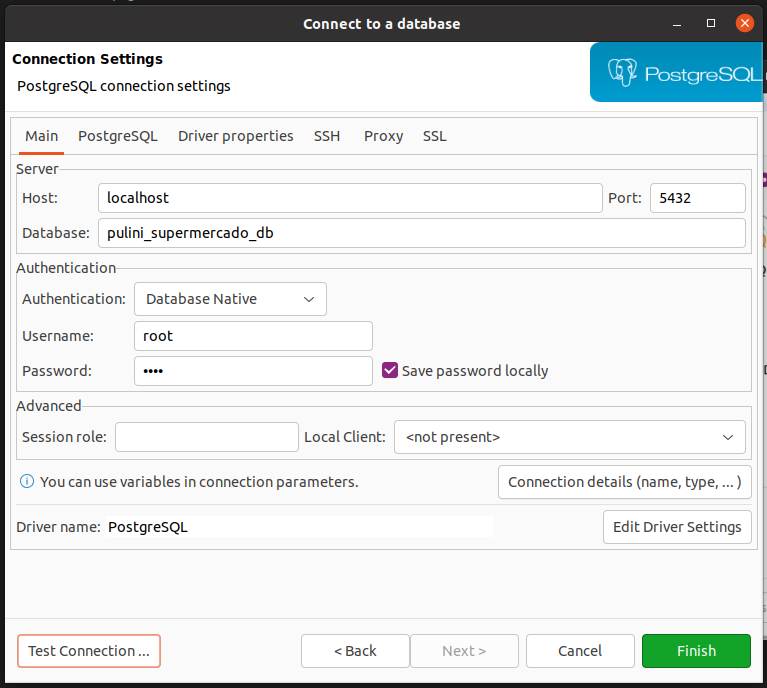

## Banco de dados

O banco de dados será levantando através do Docker com a imagem pública no [docker hub do postgres](https://hub.docker.com/_/postgres).


- Primeiro passo

Entre na raiz do projeto execute o seguinte comando

````
make database
````

- Segundo passo

Conecte no servidor do banco atravez do [dbeaver](https://dbeaver.io/download/).



**Host:** localhost

**Port:** 5432

**Database:** pulini_supermercado_db

**Username:** root

**Password:** root

- Terceiro passo

Copie todo o sql contido no arquivo [create_database.sql](create_database.sql) e execute-o.